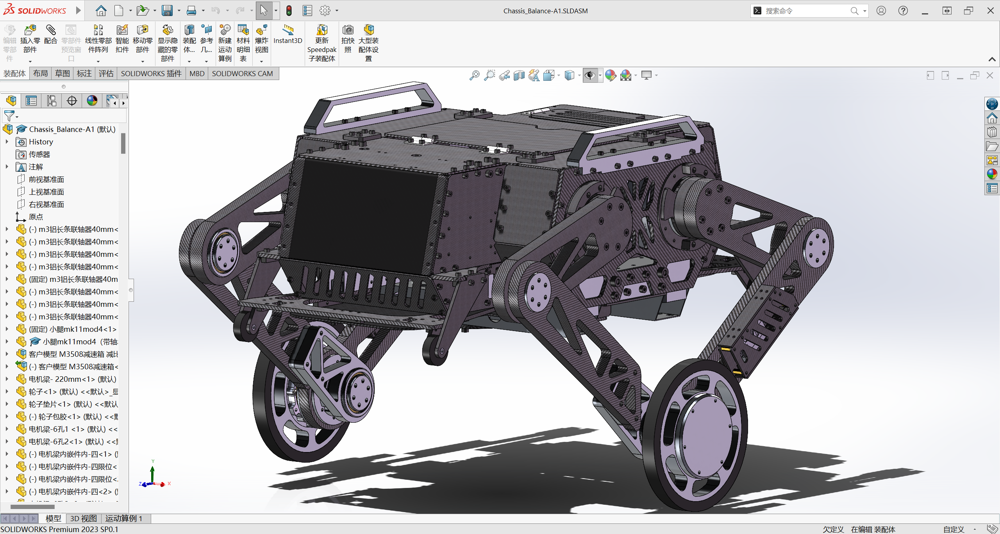
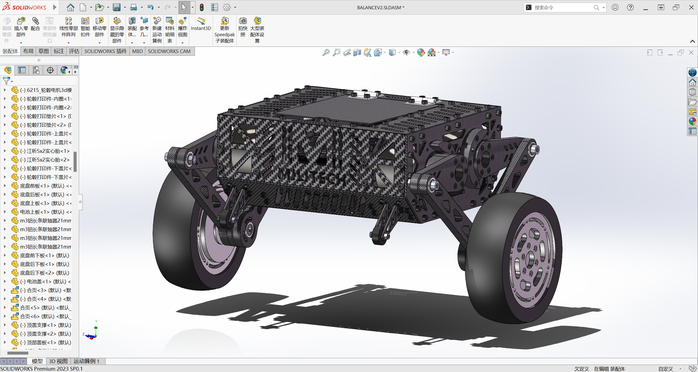
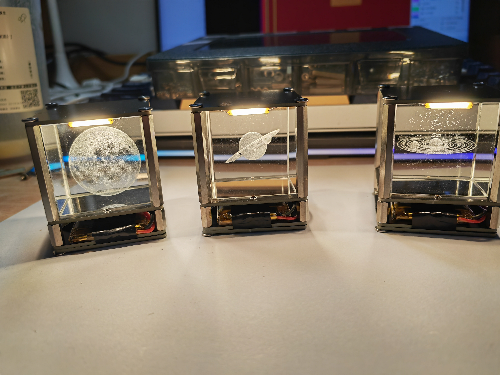

# My_Project

## 目录
### 1. [轮足机器人 Whell legged robot](#whell_legged)
### 2. [小轮足机器人](#leg)
### 3. [触摸小夜灯](#touch)
## 1.轮足机器人 Whell legged robot(持续更新中) 

  

    轮腿机器人模型

- 代码链接：
    <https://github.com/Multivac11/Wheel-legged-robot--Main_Code>
- 屏幕代码链接:
    <https://github.com/Multivac11/Wheel-legged-robot--LCD_Code>
- 模型硬件报告链接：
    <https://github.com/Multivac11/Wheel-legged-robot--Others>

## 2.小轮足机器人(待整理完善) 

  

    小轮腿机器人模型

- 项目链接：
    <https://github.com/Multivac11/Small-wheeled-robot>

## 3.触摸小夜灯(待整理完善) 

  

    触摸小夜灯

- 项目链接：
    <https://github.com/Multivac11/Touch-crystal-night-light>

